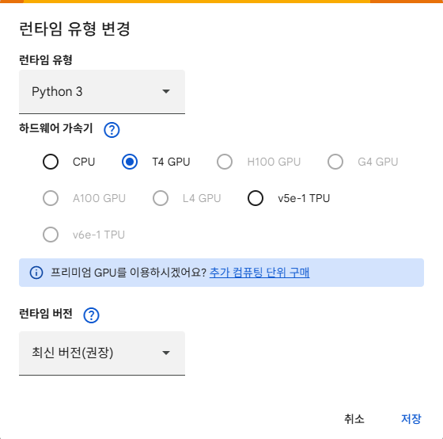
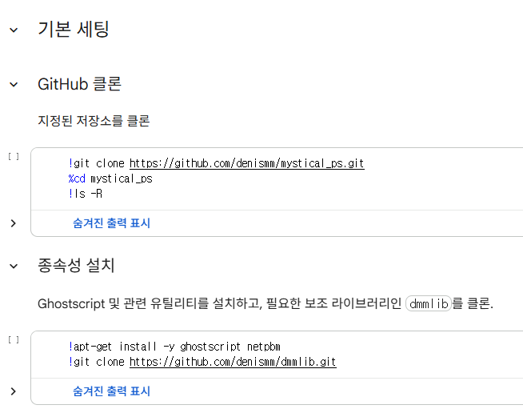
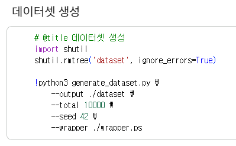
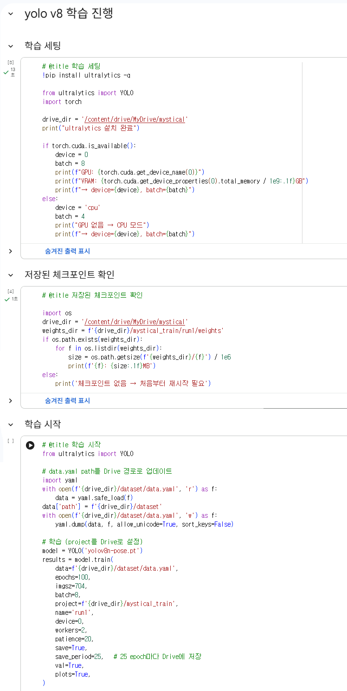

## 프로젝트 구조
```
aws_mystical/
└── mystical_deploy_kit/     # AWS 배포 자산 킷
    └── iam/
    │   └── policy 및 cors 등 json
    └── lambda/
    │   └── ps_lib/
    │   │   └── dmmlib/      # 리눅스 환경 호환 구조의 PostScript 코어 라이브러리 엔티티
    │   └── handler.py
    └── new/
    │   └── paint/
    │       └── app.js       # 웹 화면 Canvas 렌더링, 이벤트 핸들링 및 디버그 콘솔 제어
    │       └── ai.js        # ONNX 모델 로드, 전처리 데이터 생성 및 NMS 알고리즘 구현
    │       └── best.onnx
    │       └── index.html
    │       └── reset.css
    │       └── styles.css
    └── deploy.sh
    └── ghostscript-arm64.zip
    └── lambda_package.zip
```

## 모델 학습

1. colab에서 mystical의 repository를 클론
2. 실제 mystical 이미지 생성 및 사용한 ps를 응용하여 데이터셋 생성
3. 생성된 데이터셋을 바탕으로 학습진행

### 환경: colab GPU

### 기본 세팅

### 데이터셋

### 학습 진행


## 보안 처리 기록

1. 초기 commit 시에 aws 액세스 키 ignore가 누락되어 함께 커밋 되었음(추후 제거 및 ignore 처리)
2. repo를 public으로 돌리고 해당 내용이 history에서 접속가능하여 github 및 aws에서 보안관련 메일 수신
3. 유출 액세스 키를 전부 삭제 후 해당 액세스 키를 가진 IAM 사용자에서 V3 권한 삭제 처리
4. 현재 액세스 키를 신규 발급받음